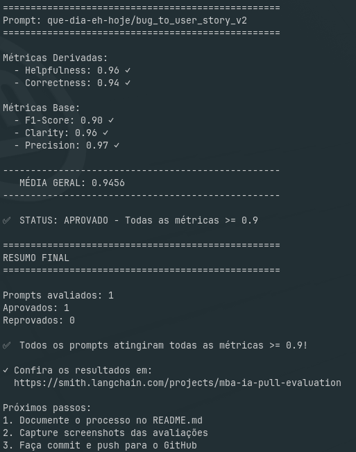

# História da Evolução do Projeto

> **MBA IA — Pull, Otimização e Avaliação de Prompts**

Este documento conta a história da evolução do projeto a partir do histórico do
Git, considerando **somente os commits do autor Ralph Baesso**.

O objetivo do desafio é: puxar um prompt deliberadamente ruim
(`leonanluppi/bug_to_user_story_v1`) do LangSmith Prompt Hub, refatorá-lo em uma
versão v2 capaz de converter relatos de bug em user stories, publicar a versão
otimizada de volta no Hub e rodar uma avaliação que precisa atingir **nota ≥ 0.9
em todas as cinco métricas** (Helpfulness, Correctness, F1-Score, Clarity e
Precision) — não apenas na média.

A jornada abaixo está organizada em seções por data, em ordem cronológica.

---

## 🏆 Prova de conclusão do desafio

A maior evidência de que o desafio foi concluído com sucesso é a avaliação final
**APROVADA**, com **todas as 5 métricas ≥ 0.9**:

> **STATUS: APROVADO — Todas as métricas >= 0.9**
>
> | Métrica | Nota | Status |
> |---|---|---|
> | Helpfulness | 0.96 | ✓ |
> | Correctness | 0.94 | ✓ |
> | F1-Score | 0.90 | ✓ |
> | Clarity | 0.96 | ✓ |
> | Precision | 0.97 | ✓ |
> | **Média geral** | **0.9456** | ✅ |
>
> Prompt avaliado: `que-dia-eh-hoje/bug_to_user_story_v2` · Prompts aprovados: 1 · Reprovados: 0.

O log completo desta run está em
[`resultados/2026-05-30_2.md`](resultados/2026-05-30_2.md) (commit `cba9c96`).

---

## 📊 Evidências das avaliações

Todas as rodadas de avaliação foram registradas no diretório
[`resultados/`](resultados/), permitindo acompanhar a evolução das métricas até
a aprovação:

| Data | Arquivo | Commit | F1 | Status |
|---|---|---|---|---|
| 28/05 | [`resultados/2026-05-28_1.md`](resultados/2026-05-28_1.md) | `3d78eb5` | 0.76 | ❌ Reprovado (correctness, f1) |
| 29/05 | [`resultados/2026-05-29_1.md`](resultados/2026-05-29_1.md) | `62b2555` | 0.86 | ❌ Reprovado (f1) |
| 30/05 | [`resultados/2026-05-30_1.md`](resultados/2026-05-30_1.md) | plano `011` | 0.90 | ✅ Aprovado |
| 30/05 | [`resultados/2026-05-30_2.md`](resultados/2026-05-30_2.md) | `cba9c96` | 0.90 | ✅ **Aprovado (0.9456)** |

A trajetória do F1-Score (0.76 → 0.86 → 0.90) conta a história das iterações: a
única métrica que travava a aprovação foi sendo atacada a cada rodada até cruzar
o limite de 0.90 com folga nas demais.

---

## 2026-05-16 — Fundação do projeto

O projeto começou montando a estrutura básica de trabalho:

- **Taskfile** (`df02543`): adicionado para orquestrar o fluxo de trabalho via
  `task <target>`, estabelecendo o Taskfile como ponto de entrada preferido.
- **`pull_prompts.py`** (`573fc7a`): implementado o *pull* do prompt baseline
  `leonanluppi/bug_to_user_story_v1` do LangSmith Hub, extraindo os prompts de
  system e user das mensagens do `ChatPromptTemplate` e salvando em YAML no
  schema esperado pelo restante do pipeline.
- **Documentação** (`74a232a`): o `CLAUDE.md` foi ajustado para priorizar os
  comandos via Taskfile.

Nesse dia nasce a fundação: a forma de rodar as tarefas e a capacidade de trazer
o prompt ruim do Hub para edição local.

---

## 2026-05-20 — Reorganização e início da experimentação

Com a base pronta, o foco passa a ser organizar a saída e começar a explorar
técnicas de prompt:

- **Reorganização** (`fd92471`): os prompts puxados foram movidos para um
  diretório estável e agnóstico de data (`pulls/`), o `OUTPUT_PATH` do
  `pull_prompts.py` foi atualizado e o `setup` do Taskfile foi simplificado
  (removendo criação de venv, cópia de `.env` e checagens que causavam
  problemas), além de desacoplar o `pull` do `setup`.
- **Nasce o v2** (`22da66b`): primeira versão otimizada, com 3 exemplos de
  few-shot, critérios de aceitação em formato Gherkin e passos de raciocínio
  interno (CoT). Removido também o bloco de comentário de "qualidade
  intencional" do YAML v1.
- **Experimentos isolados** começam:
  - **v3** (`9dc5789`): Chain-of-Thought como técnica central, combinada com
    Role Prompting leve, para isolar o impacto do CoT frente ao v2.
  - **v4** (`f30407c`): Chain-of-Thought combinado com Self-Consistency — 4
    caminhos de raciocínio independentes consolidados por consenso semântico.

Cada experimento veio acompanhado de seu documento de requisitos em `docs/`.

---

## 2026-05-27 — Expansão de técnicas, auditoria e push

Um dia intenso, dedicado a ampliar o leque de técnicas e a profissionalizar o
pipeline:

- **v5 — Tree of Thoughts** (`0cd02eb`): ToT como técnica central, com ≥3 ramos
  concorrentes expandidos a partir do bug, avaliados por critérios explícitos
  (fidelidade, clareza de persona, completude, precisão), podados com
  *backtracking* até convergir em um único ramo vencedor.
- **v6 — Skeleton of Thought** (`8407bba`): SoT como técnica central, com uma
  fase de esqueleto que produz um esboço conciso (persona, ação, benefício e
  critérios de aceitação).
- **v7 — ReAct** (`dc93272`): ciclos explícitos de Thought → Action →
  Observation sobre o relato de bug, com quatro ações obrigatórias
  (`extrair_persona`, `extrair_comportamento`, `inferir_beneficio`,
  `mapear_criterios`), cada Observation ancorada em um trecho citado.
- **Auditoria de isolamento** (`5512209`): definida a especificação de que cada
  prompt deve aplicar exatamente uma técnica da lista permitida, e produzido um
  relatório de auditoria identificando que v2, v6 e v7 estavam "misturando"
  técnicas.
- **Refactor de isolamento** (`a42bb82`): aplicadas as correções para forçar uma
  técnica única por prompt em v2–v7.
- **`push_prompts.py`** (`228a9e9`): implementado o *push* para o LangSmith Hub,
  aceitando o argumento de versão (v2–v7), rejeitando o v1 e valores inválidos,
  validando a estrutura do prompt e publicando o prompt **publicamente**, com
  tags e descrição extraídas do YAML.

---

## 2026-05-28 — Novo provedor e primeira avaliação

- **DeepSeek** (`3d78eb5`): adicionado como provedor de LLM suportado em
  `get_llm()`, usando `ChatOpenAI` com `base_url=https://api.deepseek.com`
  (endpoint compatível com OpenAI). O `.env.example` e o `CLAUDE.md` foram
  atualizados para refletir a nova opção.
- **Primeira rodada de avaliação** (`e46bf81`): documentado o resultado da
  iteração do dia em [`resultados/2026-05-28_1.md`](resultados/2026-05-28_1.md).
  Resultado **REPROVADO** (F1 = 0.76, correctness = 0.86) — o ponto de partida
  que orientou as próximas iterações.

---

## 2026-05-29 — v2 reformulado com estrutura adaptativa

- **Upgrade do v2 para Few-shot + CoT** (`62b2555`): o `system_prompt` foi
  reescrito para classificar a complexidade do bug (simples/médio/complexo) e
  selecionar a estrutura de saída via raciocínio interno (Chain-of-Thought).
  Foram adicionados formatos de saída de nível médio (com seção "Contexto
  Técnico") e complexo (com critérios de aceitação agrupados e seções
  específicas). Os exemplos de few-shot subiram de 3 (todos simples) para 5,
  incluindo um caso médio e um complexo. A proibição genérica de conteúdo
  técnico deu lugar a uma *guardrail* de precisão. As técnicas declaradas
  passaram a ser `["Few-shot Learning", "Chain-of-Thought"]`, satisfazendo o
  requisito de ≥2 técnicas. Tudo isso motivado por uma análise de causa-raiz do
  F1 < 0.9 (lacuna de recall em referências de dataset médio/complexo). A
  avaliação correspondente, em
  [`resultados/2026-05-29_1.md`](resultados/2026-05-29_1.md), subiu o F1 de 0.76
  para 0.86 — ainda **REPROVADO** por essa única métrica.

---

## 2026-05-30 — Refino final, consolidação e testes

O dia de fechamento, dedicado a estabilizar o v2 vencedor e limpar a base:

- **Resultados** (`0609f05`, `1fecfa3`): documentadas as rodadas de avaliação das
  iterações de 29/05 e 30/05, incluindo a **primeira aprovação** registrada em
  [`resultados/2026-05-30_1.md`](resultados/2026-05-30_1.md) (plano `011`, F1
  0.86 → 0.90, todas as 5 métricas ≥ 0.9).
- **Refino do v2** (`cba9c96`): reescrito o template do tier MÉDIO com seções
  condicionais (Critérios Técnicos, Exemplo de Cálculo e grupos de critérios
  nomeados), adicionada regra anti-inflação para o tier SIMPLES, classificador
  de complexidade mais rígido e *guardrail* de precisão refinada. Foram incluídos
  3 novos exemplos de few-shot, rebalanceando a cobertura para os tiers que mais
  falhavam (análise de causa-raiz do gap F1 de 0.86 → 0.90).
- **Mais resultados** (`a8f23cf`): adicionada a rodada de avaliação final
  **APROVADA** em [`resultados/2026-05-30_2.md`](resultados/2026-05-30_2.md)
  (média geral 0.9456) junto com a captura de tela
  [`2026-05-30_screeshot.png`](2026-05-30_screeshot.png) — a maior prova de que
  o desafio foi concluído.
- **Guard rail** (`fed15bf`): incluída no `CLAUDE.md` a regra que proíbe a
  execução de scripts de `src/` pelo Claude.
- **Lock no v2** (`15a607a`): removidos os experimentos v3–v7 (CoT, CoT+SC, ToT,
  SoT, ReAct), mantendo apenas o v2 (Few-shot + CoT) aprovado, e simplificado o
  `push_prompts.py` para mirar exclusivamente o v2.
- **Suíte de testes** (`bafafbc`): implementados os seis testes de validação do
  v2 (presença de system prompt, definição de papel, menção a formato, exemplos
  de few-shot, ausência de TODOs e número mínimo de técnicas), substituindo os
  stubs `pass`.

---

## Situação atual

Ao final da jornada, o projeto convergiu para um único prompt vencedor — o
**v2, combinando Few-shot Learning + Chain-of-Thought** com estrutura de saída
adaptativa por complexidade. Os experimentos paralelos (v3–v7) cumpriram seu
papel de comparação e foram removidos, e a base ficou consolidada com o
`push_prompts.py` travado no v2 e uma suíte de seis testes de validação
garantindo a integridade da estrutura do prompt.
